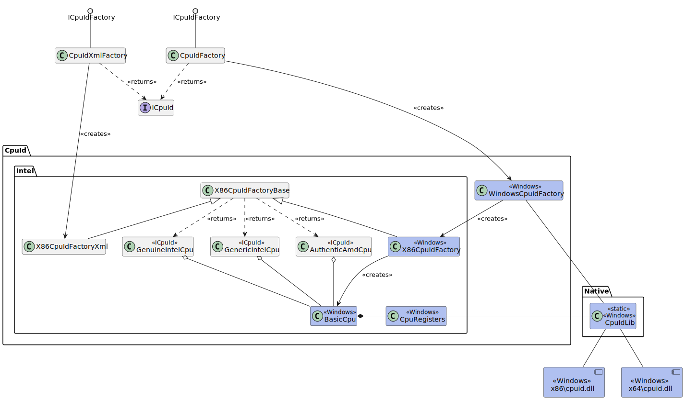
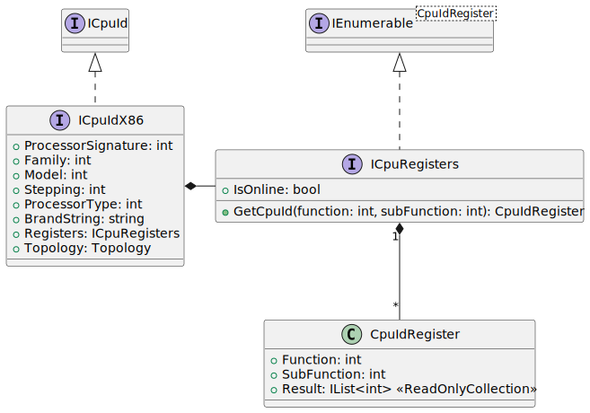
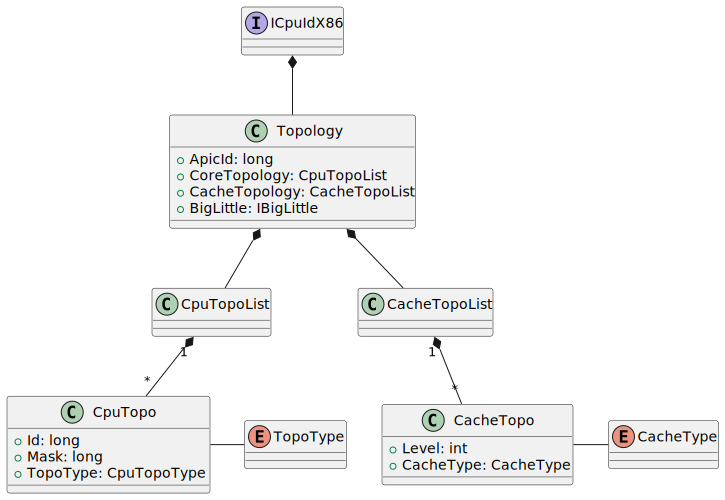
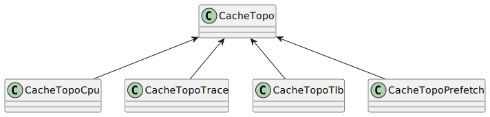

# CPUID .NET Library <!-- omit in toc -->

This document covers usage of the library and a high level overview of its
organisation. For detailed API information, see the MAML documentation in code.

<!--
    This documentation uses Visual Studio Code with Markdown All in One
    to generate the table of contents and the numbering
-->

- [1. Supported Platforms](#1-supported-platforms)
  - [1.1. Libraries and Location](#11-libraries-and-location)
- [2. Instantiating](#2-instantiating)
  - [2.1. The Factory Model Layout](#21-the-factory-model-layout)
    - [2.1.1. CPUID on Windows](#211-cpuid-on-windows)
    - [2.1.2. CPUID on Linux (Not Implemented)](#212-cpuid-on-linux-not-implemented)
  - [2.2. Instantiate from the Local CPU](#22-instantiate-from-the-local-cpu)
  - [2.3. Instantiate from a Saved XML file](#23-instantiate-from-a-saved-xml-file)
    - [2.3.1. The XML File Format](#231-the-xml-file-format)
    - [2.3.2. Writing the XML Format](#232-writing-the-xml-format)
- [3. Intel Architecture](#3-intel-architecture)
  - [3.1. Basic Information (`ICpuId`)](#31-basic-information-icpuid)
  - [3.2. Basic Information (`Intel.ICpuIdX86`)](#32-basic-information-intelicpuidx86)
  - [3.3. Dumping Registers](#33-dumping-registers)
  - [3.4. Topology](#34-topology)
    - [3.4.1. Topology Class Diagram](#341-topology-class-diagram)
    - [3.4.2. APIC Identifier](#342-apic-identifier)
    - [3.4.3. The Core Topology](#343-the-core-topology)
    - [3.4.4. The Cache Topology](#344-the-cache-topology)
- [4. Future Work](#4-future-work)
  - [4.1. Processor Groups](#41-processor-groups)
  - [4.2. Windows XP](#42-windows-xp)

## 1. Supported Platforms

This library supports only Intel and AMD processors for Windows XP and later. It
consists of two parts:

- Native DLL for 32-bit and 64-bit Intel, compiled with Visual Studio 2022 with
  Windows XP support; and
- .NET DLL for parsing the CPUID information returned on those processors.

The library is required to get access to the native CPU instruction CPUID for a
live capture.

### 1.1. Libraries and Location

The .NET assembly supports 32-bit and 64-bit. For this, the library `cpuid.dll`
is required where the assembly is in the folder `x86` for 32-bit and `x64` for
64-bit. On startup with Windows, it checks the bit-size through `IntPtr` and
then uses the Operating System call `LoadLibrary` to load the appropriate
version. The APIs between 32-bit and 64-bit are identical.

If the libraries are not found, or can't be loaded by the Operating System, you
will not be able to get CPUID information for the current CPU.

## 2. Instantiating

The library uses the _factory_ model. You do not instantiate classes directly.

### 2.1. The Factory Model Layout

To get the CPUID settings for all cores in the system, call the
`ICpuIdFactory.CreateAll()` method that returns an `IEnumerable<ICpuId>`. There
are multiple factories for getting this information, whether it be from the
local machine, or a file saved on disk. To add extra functionality, one can
provide a custom implementation based in `ICpuIdFactory`.



The diagram above shows, that when instantiating via the `CpuIdFactory`, it
obtains the information from the CPU(s) managed by the OS.

When instantiating the `CpuIdXmlFactory`, the objects are read from an XML file.
This is interesting to analyse CPUID dumps of other machines, for example, to
perform post-mortem analysis.

#### 2.1.1. CPUID on Windows

The first class responsible for reading the CPUID information is the
`WindowsCpuIdFactory` which loads the appropriate DLL dependending on the
architecture which is running. This is a feature of Windows, that once the DLL
is loaded in memory, P/Invoke simply only needs to refer to the DLL image in
memory, not on disk, so all P/Invoke methods are applicable for 32-bit as well
as 64-bit so long as the library is loaded prior.

The `WindowsCpuIdFactory` then calls `X86CpuIdFactory` that calls the loaded
library to retrieve the CPUID information. It's not shown in the above diagram,
but the libraries are wrapped around the class `CpuIdLib` which P/Invokes into
the native windows libraries.

#### 2.1.2. CPUID on Linux (Not Implemented)

You can see in the UML diagram, that the code is not implemented for Linux.
However, the software is architected that it could be easy to add.

- Create a new `LinuxCpuIdFactory` class, that derives from
  `X86CpuIdFactoryBase`.
- There are multiple ways of reading the CPUID information. One could use the
  Kernel interfaces, a kernel module, or write a shared object that obtains this
  information. One could implement a factory for each mechanism, and then
  iterate through each factory in the order preferred, until the information is
  obtained.
- The factory class would read the information, put it into a `BasicCpu`
  structure (not shown) and call the base class. All parsing of the CPUID
  information is already implemented.

### 2.2. Instantiate from the Local CPU

Use the following code snippet:

```csharp
using RJCP.Diagnostics;
using RJCP.Diagnostics.CpuId;

ICpuIdFactory factory = new CpuIdFactory();
ICpuId cpu = factory.Create();
```

The resultant `ICpuId` contains the information required. The information is
obtained for the CPU that the thread was running on and should be fixed prior
using Operating System calls for managing threads to have its affinity to only a
single CPU.

To get a collection of all CPUs that the Operating System is aware of:

```csharp
using SYstem.Collections.Generic;
using RJCP.Diagnostics;
using RJCP.Diagnostics.CpuId;

ICpuIdFactory factory = new CpuIdFactory();
IEnumerable<ICpuId> cpus = factory.CreateAll();
```

You may then enumerate through the `cpus` to get the details for each CPU in the
system, be it a core/thread or a separate package. It uses the Operating System
to get the number of processors in the system (specifically, only for the
current processor group on Windows, which is supported on Windows Vista and
later).

### 2.3. Instantiate from a Saved XML file

Use the following code snippet to load data from a previously saved XML file.

```csharp
using SYstem.Collections.Generic;
using RJCP.Diagnostics;
using RJCP.Diagnostics.CpuId;

string fileName = "cpu.xml";
CpuIdXmlFactory factory = new CpuIdXmlFactory();
IEnumerable<ICpuId> cpus = factory.CreateAll(fileName);
```

The factory `CpuIdXmlFactory` implements the `ICpuIdFactory` interface, so it
can be used as a mock in your unit testing.

```csharp
using SYstem.Collections.Generic;
using RJCP.Diagnostics;
using RJCP.Diagnostics.CpuId;

ICpuIdFactory factory = new CpuIdXmlFactory() {
    FileName = "cpu.xml";
};
IEnumerable<ICpuId> cpus = factory.CreateAll();
```

#### 2.3.1. The XML File Format

The file format is simple:

```xml
<?xml version="1.0" encoding="utf-8"?>
<cpuid type="x86">
  <processor>
    <register eax="00000000" ecx="00000000">00000016,20202020,20202020,20202020</register>
    <register eax="80000000" ecx="00000000">80000008,00000000,00000000,00000000</register>
  </processor>
</cpuid>
```

The attribute `eax` is the CPUID function requested, where `ecx` is the sub-leaf.

#### 2.3.2. Writing the XML Format

There is the program `CpuIdCon` which does this in only a few lines. Most of the
work is in the framework itself. You can use this for your own programs to make
a dump within code.

```csharp
using SYstem.Collections.Generic;
using RJCP.Diagnostics;
using RJCP.Diagnostics.CpuId;

ICpuIdFactory cpuFactory = new CpuIdFactory();
IEnumerable<ICpuId> cpus = cpuFactory.CreateAll();

CpuIdXmlFactory.Save("cpus.xml", cpus);
```

## 3. Intel Architecture

### 3.1. Basic Information (`ICpuId`)

Intel and AMD both support getting the following information:

- The `CpuVendor` which is an enumeration derived by the detection routines of
  CpuId.NET.
  - For CPUs not supported, the value returned is `CpuVendor.Unknown`.
- The string `VendorId` which is the string returned in `CPUID(01h)`.
- A description (brand string) returned by `CPUID(8000_0001h)` to
  `CPUID(8000_0004h)`. Intel and AMD recommend using this to get a brand name of
  the processor.
- A set of available `Features`, which is a dictionary. Query the feature and it
  returns `true` or `false` if the feature is known or not supported.

### 3.2. Basic Information (`Intel.ICpuIdX86`)

Further information returned, which requires a type cast to `Intel.ICpuIdX86`
interface offers in addition:

- The `ProcessorSignature`
- The `Family` which is a combination of the original family and extended
  family, derived from the `ProcessorSignature`
- The `Model` which is a combination of the original model and the extended
  model, derived from the `ProcessorSignature`
- The `Stepping`, derived from the `ProcessorSignature`
- The `ProcessorType`, derived from the `ProcessorSignature`
- The `BrandString`, derived from the Family and Model, translated to a string
  as per AMD/Intel documentation. It is recommended to use the `Description`
  instead.
- Access to the CPUID registers through `Registers`
- Information about the CPU Topology via `Topology`



### 3.3. Dumping Registers

The CpuId.NET library caches the results of the CPUID instruction in local
memory for the current CPU. On query of a register that is not known, it will
execute the CPUID instruction. You must make sure when querying the registers
that your software manages and maintains the correct processor core that
consistent results are returned. Querying the CPUID registers across multiple
different cores may result in inconsistent results.

For example, Intel has `CPUID(0Bh, level)`, which the `EDX` register returns the
APIC identifier for the current CPU. When the thread changes, the APIC
identifier may change and can result in inconsistent results.

Once the value is read, it is cached and does not change so that other threads
can process the data on any available thread.

The initial set of CPUID registers which are cached is obtained by the DLL. This
makes the DLL responsible for "knowing" all applicable CPUID registers when just
instantiating and then dumping the registers to a file. If registers are
missing, application code can query further registers.

### 3.4. Topology

The `Topology` field of type `Intel.Topology` supports basic APIC information
and determining the structure of the CPU. It first contains the `ApicId` which
is usually the initial APIC identifier on system start, but may sometimes be
assigned by the BIOS. This can be used to help identify the various processors
and their relationship.

#### 3.4.1. Topology Class Diagram

This class diagram gives an overview of the x86 topology information:



#### 3.4.2. APIC Identifier

If the `cpu.Topology.ApicId` is -1, then the topology is not supported, and the
`cpu.Topology` can be ignored.

#### 3.4.3. The Core Topology

To learn how the cores are organized within the CPU, each CPU has a
`CoreTopoList` exposed by `Topology.CoreTopology`. This is a list of properties,
which describe the thread (SMT), the core and the package. On newer versions of
Intel which support leaf `CPUID(1Fh)`, it can also describe the module, tile and
die.

It only provides information given by the CPUID instruction. There is no concept
of a NUMA node given in CPUID, and is normally part of the BIOS in the ACPI
table, which is out side of the scope of CpuId.NET.

Each element contains an identifier (which thread, which core, which package
number) which is derived from the APIC identifier.

#### 3.4.4. The Cache Topology

Each core has cache, exposed by `Topology.CacheTopoList`. This is a list of
different caches for Data, Instruction, Unified caches for the CPU or MMU (TLB).



## 4. Future Work

### 4.1. Processor Groups

The library does not support Processor Groups. It would need to be determined
how to support this for Windows XP (which doesn't have processor groups) and
Windows Vista and later, which do.

See [CpuIdDll/DESIGN.md](../../CpuIdDll/docs/DESIGN.md) for more information.

### 4.2. Windows XP

It would be interesting to keep Windows XP support (which includes Windows
Server 2003). This allows for the capture of older CPUs, which newer versions of
Windows does not support.
