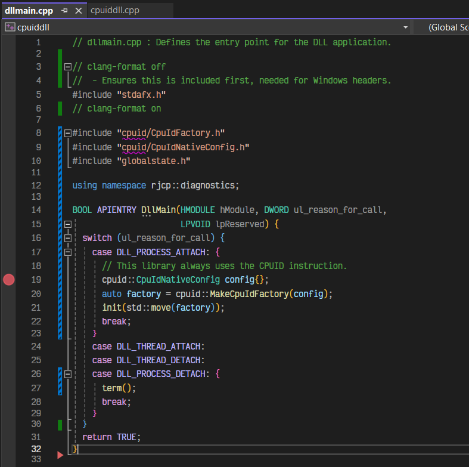

# To debug the DLL with VS2022 <!-- omit in toc -->

Refer to [How to Debug from a DLL
Project](https://learn.microsoft.com/en-us/visualstudio/debugger/how-to-debug-from-a-dll-project?view=vs-2022)
for precise details.

- [1. Development Environment](#1-development-environment)
- [2. Project Configuration](#2-project-configuration)
  - [2.1. General Set Up](#21-general-set-up)
  - [2.2. Debugging a .NET Framework Test Case (NUnit3)](#22-debugging-a-net-framework-test-case-nunit3)
- [3. Build for Debugging](#3-build-for-debugging)
- [4. Set up Break Points](#4-set-up-break-points)

## 1. Development Environment

I use Visual Studio 2022 on Windows 11 (which is only 64-bit), with the
Developer Drive set up, so that my drive `D:\` contains my projects.

## 2. Project Configuration

### 2.1. General Set Up

From the VS2022 CPUID.DLL library:

* Right click on the `cpuiddll` project and select *Properties*.

* From the *Debugging* tab, change the command to project that loads this DLL.
  e.g.

  `D:\rjcp.base\framework\cpuid\CpuIdCon\bin\Debug\net40\CpuIdCon.exe`

  

### 2.2. Debugging a .NET Framework Test Case (NUnit3)

Using the same technique above, it is possible to configure the VS2022 to run
the `nunit3.consolerunner` and run a specific test case for us. This can help
isolate specific issues.

* Command:
  `D:\.nuget\packages\nunit.consolerunner\3.16.3\tools\nunit3-console.exe`
* Command Arguments: `--test=RJCP.Diagnostics.Native.CpuIdLibTest.GetCpuId
  --process=INPROCESS .\RJCP.Diagnostics.CpuIdTest40.dll`
* Working Directory:
  `D:\rjcp.base\framework\cpuid\CpuIdTest\legacy\bin\Debug\net48`

The technique works only if the `nunit3-console.exe` doesn't spawn a new process
(thus requiring the `--process=inprocess` option), which therefore requires a
.NET Framework test fixture, because the `nunit3-console.exe` is also a .NET
Framework binary.

Also note, it's likely desirable to set the *Debugger Type* to be *Mixed*, to
properly see backtraces and code from the .NET binary.

## 3. Build for Debugging

Build the version of the library that is appropriate for the target reviewed in
the previous step. For example, the 64-bit Debug version is usually the most
appropriate.

Ensure after the build to copy the DLL to the relevant folders. Run the
`cpdll.bat` in this directory. That is because the projects that run will use a
different compiled version otherwise.

## 4. Set up Break Points

To confirm that the library is being debugged, ensure to set up a break point in
the `dllmain` function (such as line 19 here):

 

When running with F5, the application should start and this breakpoint is
entered as soon as the library is loaded. If this breakpoint isn't hit, then
this library isn't being debugged.
