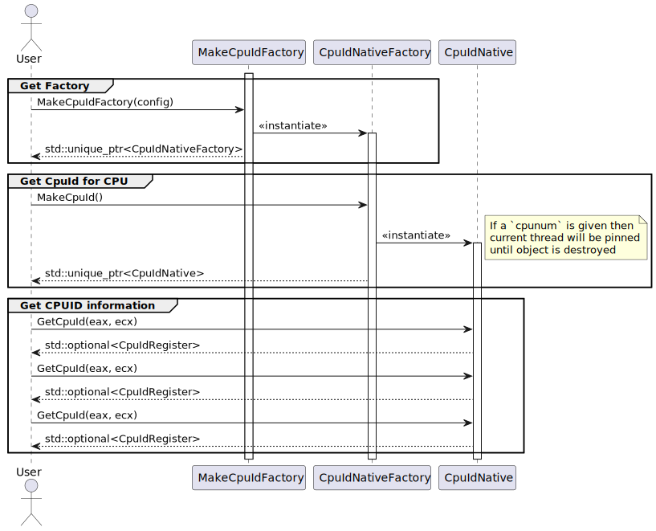
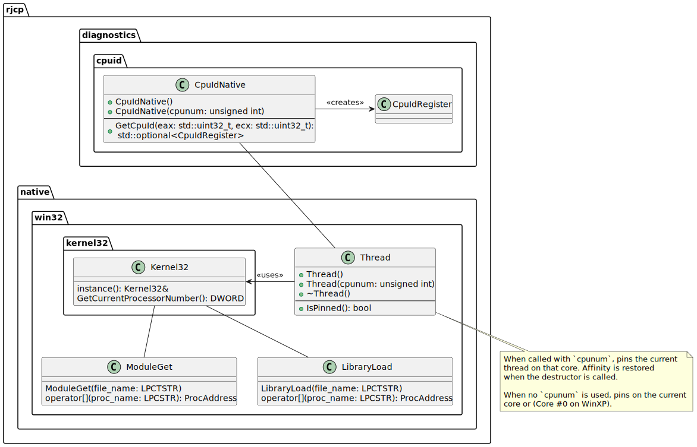
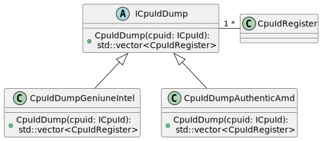

# Design Overview <!-- omit in toc -->

This document covers the design and layout of the DLL project.

- [1. Public API](#1-public-api)
  - [1.1. Calling Convention](#11-calling-convention)
  - [1.2. Exception Handling in C++](#12-exception-handling-in-c)
- [2. Code Structure](#2-code-structure)
  - [2.1. Entry Point and API](#21-entry-point-and-api)
  - [2.2. Source Layout](#22-source-layout)
  - [2.3. Precompiled Headers](#23-precompiled-headers)
- [3. Detailed Design](#3-detailed-design)
  - [3.1. Class Layout](#31-class-layout)
  - [3.2. Obtaining a CPUID result with `MakeCpuIdFactory`](#32-obtaining-a-cpuid-result-with-makecpuidfactory)
    - [3.2.1. Extensions with `MakeCpuIdFactory`](#321-extensions-with-makecpuidfactory)
  - [3.3. CpuIdNative](#33-cpuidnative)
    - [3.3.1. Thread Implementation](#331-thread-implementation)
    - [3.3.2. Kernel32 Class and Windows XP compatibility](#332-kernel32-class-and-windows-xp-compatibility)
      - [3.3.2.1. Windows XP GetCurrentProcessorNumber](#3321-windows-xp-getcurrentprocessornumber)
      - [3.3.2.2. Future Work: Processor Groups](#3322-future-work-processor-groups)
  - [3.4. Dumping CPUID for a Processor](#34-dumping-cpuid-for-a-processor)

## 1. Public API

Other libraries that wish to include this code can include `cpuiddll.h`. This
automatically sets the `extern C` for the public API.

### 1.1. Calling Convention

The library towards the outside does not expose its C++ implementation details.
The library interfaces are standard `stdcall` calling convention for 32-bit and
`fastcall` calling convention for 64-bit Intel architectures. There is no name
mangling.

### 1.2. Exception Handling in C++

There are no exceptions generated by this library. The DLL has been compiled to
disable exceptions.

## 2. Code Structure

### 2.1. Entry Point and API

The entry point to the library is found in `dllmain.cpp`.

### 2.2. Source Layout

```text
cpuidll\
  +-inc\                Public API
  |  +-cpuiddll.h         Public Header file
  +-rsrc\               Resources for Windows
  +-src\                All source and private headers
     +-cpuiddll.cpp       Public API implementation
     +-cpuidx64.asm       CPUID function for 64-bit fast calling convention
     +-cpuidx86.asm       CPUID function for 32-bit stdcall convention
     +-dllmain.cpp        Windows DllMain implementation
     +-globalstate.cpp    Global variables, only for cpuiddll.cpp, dllmain.cpp
     +-globalstate.h
     +-stdafx.cpp         Windows precompiled header file
     +-stdafx.h           Windows header definitions
     +-targetver.h        Windows header definitions
     +-cpuid\           C++17 classes for CPUID. See UML diagrams for details.
     |  +- ...
     |  +- ...
     +-native\          Operating specific implementations
        +-win32\
           +-Thread.cpp
           +-Thread.h
```

### 2.3. Precompiled Headers

This project does not use precompiled headers, so that non-Windows specific code
doesn't need to continue to include `stdafx.h`.

The precompiled header file `stdafx.h` is still present as a convenience for
defining the proper Windows version when including the header files, as well as
disabling features that collide with C++17 (such as `min` and `max`).

## 3. Detailed Design

The following sections cover the UML layout of the project.

### 3.1. Class Layout

The class layout for creating an object that can retrieve CPUID information:


Factories will enable in the future other scenarios to:

- Test implementation details using predefined CPUID data
- Other mechanisms to obtain CPUID data, such as from device drivers (e.g. on
  Linux using `/dev/cpu/n/cpuid`.

### 3.2. Obtaining a CPUID result with `MakeCpuIdFactory`

The mechanism to get a class that can return results of the CPUID:



- Create an instance of `CpuIdNativeConfig`. There is no configuration needed
  for querying the CPUID natively.

  ```cpp
  using namespace rjcp::diagnostics::cpuid;
  CpuIdNativeConfig config{};
  ```

- Get the factory.

  ```cpp
  auto factory = MakeCpuIdFactory(config);   // Returns a std::unique_ptr<CpuIdNativeConfig>
  ```

- From the factory, get an object that can query the CPUID instruction. There
  are two variants, one that uses the current CPU thread (the parameterless
  method), the other requires a CPU number which is then used to pin the current
  thread on, until the object is destructed.

  ```cpp
  auto cpuidg = factory->MakeCpuId();        // Isn't tied to a thread
  auto cpuid0 = factory->MakeCpuId(0);       // Tied to CPU0
  ```

  Note, in the second case, you must be aware that the current thread will now
  have an affinity for the core requested. If this is undesirable, ensure to run
  this code on a separate thread first.

- Query the CPUID information

  ```cpp
  auto cpuidr = cpuidg->GetCpuId(eax, ecx).value();
  ```

  Note, the return type is an `std::optional`, as the information may not be
  available.

- Print the results

  ```cpp
  std::cout << cpuidr.Eax() << "\t" << cpuidr.Ebx() << "\t"
            << cpuidr.Ecx() << "\t" << cpuidr.Edx() << std::eol;
  ```

#### 3.2.1. Extensions with `MakeCpuIdFactory`

Let's say for example we wish to read a JSON file that contains the CPUID
results we want. The file itself contains all CPUID results that are interesting
for a given system, containing multiple CPUs. This section gives an overview of
how to extend functionality.

A user could instantiate a new `CpuIdJsonConfig` that the file name can be
specified.

A new function `MakeCpuIdFactory(CpuIdJsonConfig& config)` would return a
`CpuIdJson` that knows how to read the JSON file and return the results in a
`CpuIdRegister` object.

All classes that operate on CPUID data can take a `ICpuId` object to get the
information.

### 3.3. CpuIdNative

This is the class that gets the CPUID information. On construction, it will
optionally call functions specific to the Operating System to pin the current
thread to the core that is required. This is necessary so that the results of
the CPUID are consistent (to avoid the scheduler from changing the thread to a
different core). CPUID information is unique for the core being queried.



#### 3.3.1. Thread Implementation

The `Thread` class is for pinning the current thread on a hardware thread. It is
necessarily Operating System specific. It implements the well known C++ "pimpl"
pattern to abstract away the Operating System includes. Other Operating Systems
can provide their own implementation of `Thread` (e.g. QNX, Linux, etc.).

The current implementation uses Windows functions which are available since
Windows XP.

Further implementation can use Windows functionality to search for processor
groups.

#### 3.3.2. Kernel32 Class and Windows XP compatibility

Windows XP is the baseline implementation and so the project officially targets
only Windows XP API. However, it should use newer APIs when available,
especially to target 64-bit.

The class `Kernel32` abstracts API that isn't avaiable, by dynamically loading
system libraries and using
[GetProcAddress](https://learn.microsoft.com/en-us/windows/win32/api/libloaderapi/nf-libloaderapi-getprocaddress)
to test for and use missing functionality.

This programming idiom allows future versions of the library to target newer
Operating Systems, while still maintaining compatibility to older Operating
Systems.

##### 3.3.2.1. Windows XP GetCurrentProcessorNumber

Windows XP doesn't support pinning the current thread to the current CPU. To do
this, it needs the function
[GetCurrentProcessorNumber()](https://learn.microsoft.com/en-us/windows/win32/api/processthreadsapi/nf-processthreadsapi-getcurrentprocessornumber),
which is only available on Windows Vista and later (only Windows XP drivers have
access to this function).

The function is dynamically loaded through
[GetProcAddress](https://learn.microsoft.com/en-us/windows/win32/api/libloaderapi/nf-libloaderapi-getprocaddress)
to see if it exists. If it does (which is on Windows Vista and later), then the
call is used. Otherwise, other mechanisms are used:

- Check for
  [NtGetCurrentProcessorNumber](https://learn.microsoft.com/en-us/windows/win32/procthread/ntgetcurrentprocessornumber).
  This exists on Windows Server 2003 and may exist on Windows XP (tested with
  Windows XP SP3 as being present).
- Failing that, a fallback mechanism is used, where each CPU thread available in
  the system (is limited to 32 threads on Windows XP) is queried with the
  CPUID.01h.EBX[31:24] bits, that contains the CPU APIC ID. Then the workaround
  is to query via the CPUID instruction the APICID for which we can then derive
  the current thread.

The implementation detail is through the singleton
`rjcp::native::win32::kernel32::Kernel32`. It uses the class
`rjcp::native::win32::ModuleGet` to get a handle to `kernel32.dll` (under the
hood
[GetModuleHandleW()](https://learn.microsoft.com/en-us/windows/win32/api/libloaderapi/nf-libloaderapi-getmodulehandlew))
and dynamically get the address to the desired function.

##### 3.3.2.2. Future Work: Processor Groups

Systems are now regularly exceeding 64 CPU Cores on 64-bit systems, and so to
query further threads, processor groups must be used to pin on other threads. I
don't have a (Windows) system with more than 64-hardware threads to implement
and test.

### 3.4. Dumping CPUID for a Processor

The library supports querying all relevant CPUID leaves for a specific
processor. The processors supported are:

- GenuineIntel
- AuthenticAMD

A free function `CpuIdDump(cpuid: ICpuId) -> std::vector<CpuIdRegister` is
implemented that:

- Gets the basic leaf to identify the brand name; then
- Instantiates the appropriate class deriving from `ICpuIdDump`; then
- Executes `CpuIdDump` on that object to get the dump of all relevant CPUID
  leaves.



The class returns a vector of `CpuIdRegister` elements. This is different to the
`cpuiddll.h` definition which uses a different `C` compatible structure. While
there is a small performance impact of converting the C++ to C structures, this
is desired for a potential portability to other Operating Systems (e.g. Linux
doesn't natively have a DWORD).
