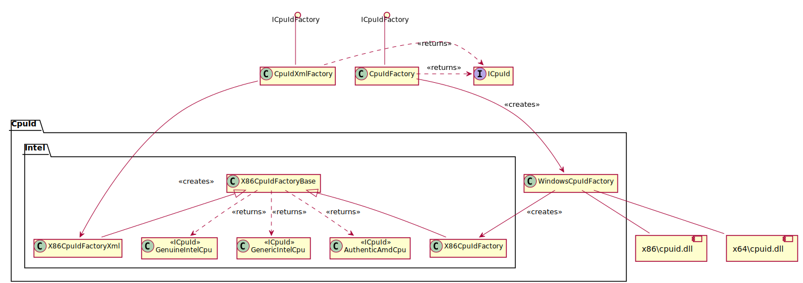

# CpuIdFactory

To get the CPUID settings for all cores in the system, call the
`ICpuIdFactory.CreateAll()` method that returns an `IEnumerable<ICpuId>`. There
are multiple factories for getting this information, whether it be from the
local machine, or a file saved on disk. To add extra functionality, one can
provide a custom implementation based in `ICpuIdFactory`.

The diagram above shows, that when instantiating via the `CpuIdFactory`, it
obtains the information from the CPU(s) managed by the OS.

When instantiating the `CpuIdXmlFactory`, the objects are read from an XML file.
This is interesting to analyse CPUID dumps of other machines, for example, to
perform post-mortem analysis.

## CPUID on Windows

The first class responsible for reading the CPUID information is the
`WindowsCpuIdFactory` which loads the appropriate DLL dependending on the
architecture which is running. This is a feature of Windows, that once the DLL
is loaded in memory, P/Invoke simply only needs to refer to the DLL image in
memory, not on disk, so all P/Invoke methods are applicable for 32-bit as well
as 64-bit so long as the library is loaded prior.

The `WindowsCpuIdFactory` then calls `X86CpuIdFactory` that calls the loaded
library to retrieve the CPUID information. It's not shown in the above diagram,
but the libraries are wrapped around the class `CpuIdLib` which P/Invokes into
the native windows libraries.

## CPUID on Linux (Not Implemented)

You can see in the UML diagram, that the code is not implemented for Linux.
However, the software is architected that it could be easy to add.

* Create a new `LinuxCpuIdFactory` class, that derives from
  `X86CpuIdFactoryBase`.
* There are multiple ways of reading the CPUID information. One could use the
  Kernel interfaces, a kernel module, or write a shared object that obtains this
  information. One could implement a factory for each mechanism, and then
  iterate through each factory in the order preferred, until the information is
  obtained.
* The factory class would read the information, put it into a `BasicCpu`
  structure (not shown) and call the base class. All parsing of the CPUID
  information is already implemented.
